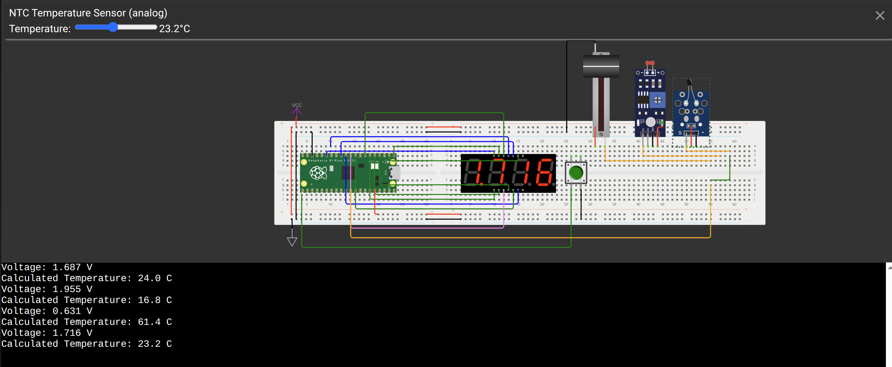

# Embedded Voltmeter and Sensor Reader with Raspberry Pi Pico

This project demonstrates the design and implementation of an embedded voltmeter and multi-sensor reader using a Raspberry Pi Pico (RP2040) and MicroPython. The system measures analog inputs from different sources and displays the readings on a 4-digit 7-segment display without any perceivable flicker.

## 🚀 Features

*   **Interrupt-Driven Input:** Utilizes edge-triggered hardware interrupts for the pushbutton.
*   **Button Debouncing:** Implements a software debouncing algorithm (200ms) to ensure accurate, single-trigger readings.
*   **Display Scanning Algorithm:** Uses hardware timers to continuously refresh the 4-digit 7-segment display (multiplexing) to prevent flickering.
*   **Analog to Digital Conversion (ADC):** Reads and averages multiple ADC samples to minimize fluctuations and calculate accurate voltage levels (0 - 3.3V).
*   **NTC Temperature Calculation:** Converts the analog voltage read from an NTC thermistor directly into Celsius using the Steinhart-Hart equation.

## 🛠️ Hardware Components

*   Raspberry Pi Pico (RP2040)
*   4-Digit 7-Segment Display (Common Anode)
*   1x Pushbutton
*   1x Slide Potentiometer
*   1x Photoresistor (LDR)
*   1x Analog Temperature Sensor (NTC)
*   Breadboard & Jumper Wires

## 📸 Circuit Diagram

 

## 💻 How It Works

1.  The system initializes the GPIO pins for the 7-segment display and configures the ADC pin.
2.  A timer periodically calls the `scan_display` function to multiplex the 7-segment display digits.
3.  When the pushbutton is pressed, an interrupt is triggered.
4.  The system reads the current voltage from the active sensor (Potentiometer, LDR, or NTC), averages the readings for stability, and updates the global display variable.
5.  If the NTC is connected, it also calculates and prints the temperature in Celsius to the console.

## 🌐 Try it on Wokwi

You can view and simulate this project directly in your browser using Wokwi:
[Wokwi](https://wokwi.com/projects/463464039491235841)
